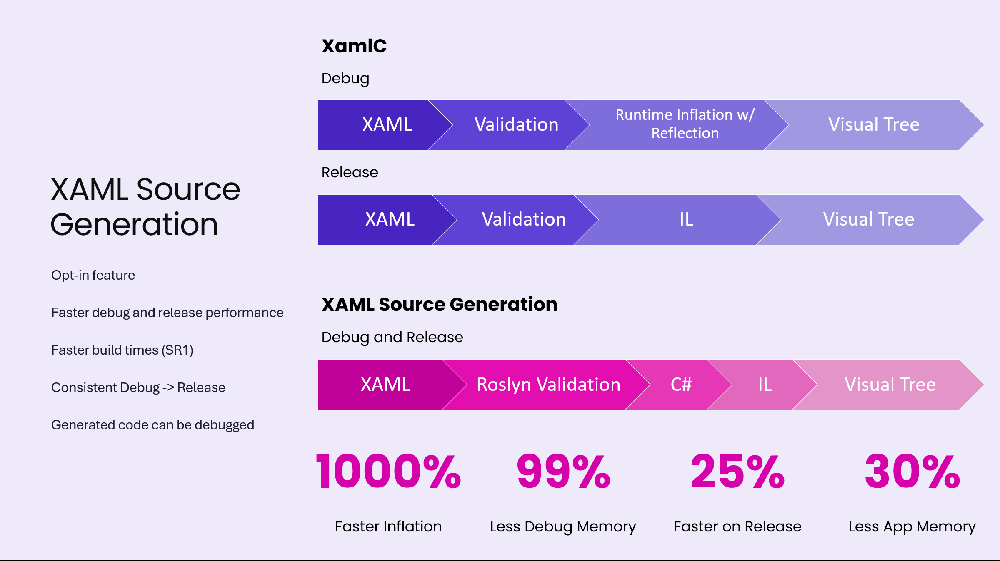
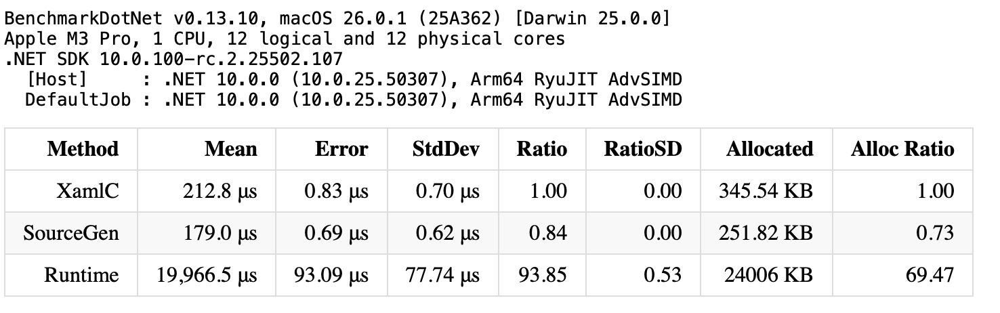

# MauiXamlSourceGenDemo

Check out the video walkthrough: 

Sample code to demonstrate how to enable XAML Source Generation with .NET MAUI 10

## How to enable?

1. Make sure to use at least .NET MAUI 10 RC2 or up
1. In your csproj add `<MauiXamlInflator>SourceGen</MauiXamlInflator>`
1. Optionally, add `<EmitCompilerGeneratedFiles>true</EmitCompilerGeneratedFiles>` to show the generated code by the source generator
   1. Note that on Windows this might generate compile errors when used from Visual Studio. In Visual Studio, this setting is not needed, just go to the Solution Explorer > your solution > your project > Dependencies > the TFM you're after for instance net10.0-android > Analyzers > Microsoft.Maui.Controls.SourceGen > Microsoft.Maui.Controls.SourceGen.CodeBehindGenerator > the xsg files are the files with the source generated code.
   1. To overcome the build errors when enabling this you might want to also set `<CompilerGeneratedFilesOutputPath>C:\x</CompilerGeneratedFilesOutputPath>` and make sure the path is the shorters path that is available on your machine. Make sure the folder exists.

## Why use XAML Source Generation?

* Much faster debug builds
* Debug and release builds are more similar if not identical
* Step through your XAML code and debug
* Future-proof: for instance, we can now write Roslyn analyzers against our XAML code to warn you for common pitfalls

Have a look at the below table for the benchmark we did on the `InitializeComponent()` method on the `Styles.xaml` file for our new MAUI template including the sample content.

